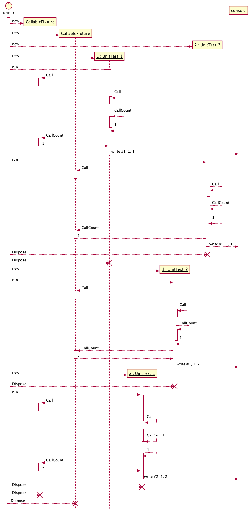
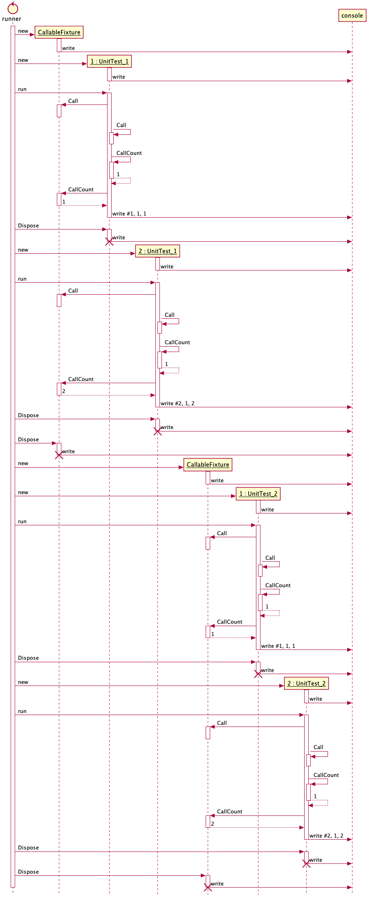
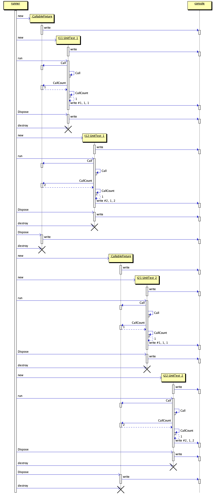

# My First Unit Tests

An exercise in using xUnit.

Based on [this tutorial](https://xunit.net/docs/getting-started/netcore/cmdline).

## To Run the Tests

```bash
dotnet test
```

You can use the output messages to figure out when various objects are created.



The parallel execution of unit tests can be confusing.  Here is a cleaned up
version.



This other version, drawn with [`sdedit`](http://sdedit.sourceforge.net/),
highlights the lifelines a little better.


